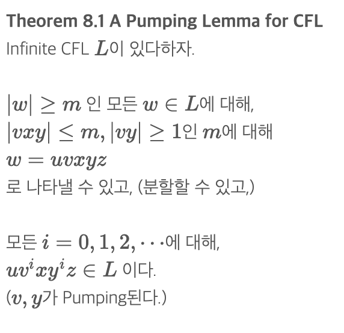
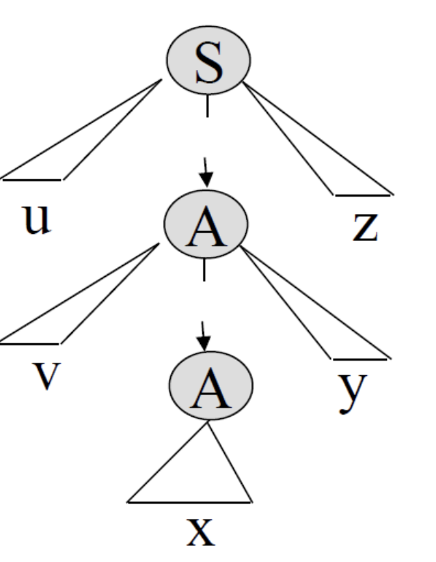
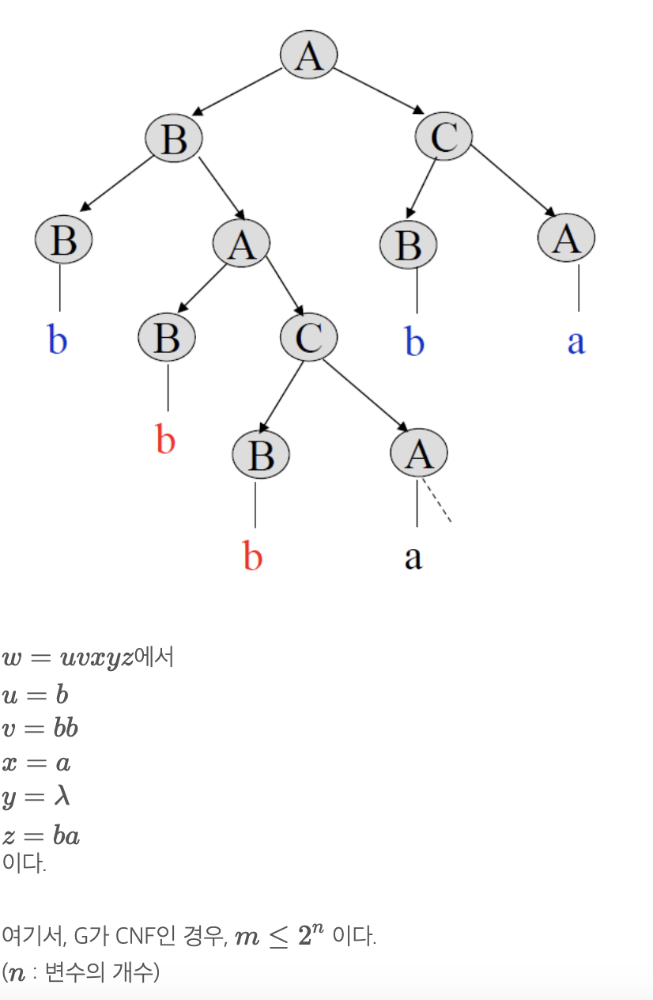
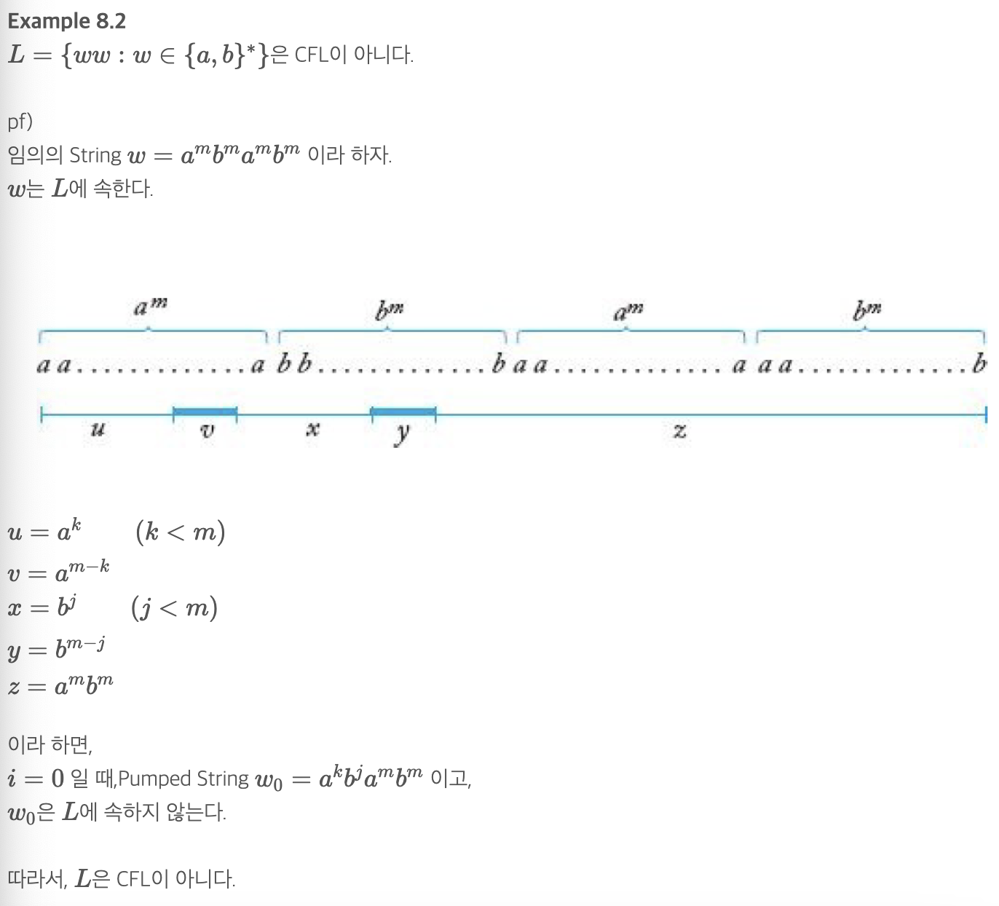
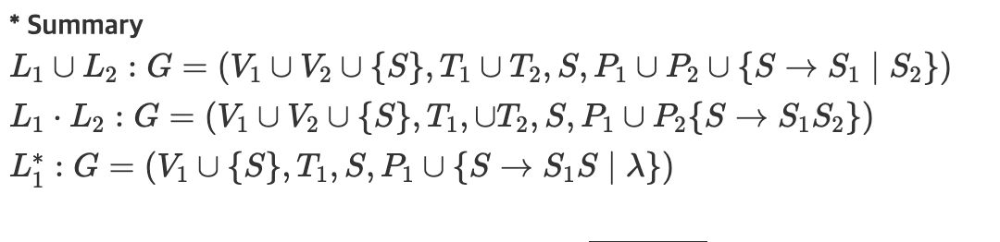
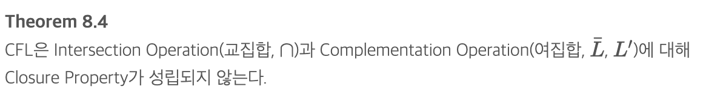

# Properties of Context-Free Languages(문맥 자유 언어의 성질들)

## Two pumping Lemmas(두 펌핑 보조 정리들)
|||
|-----|-----|

#### Pumping lemmas 정리
Grammar가 아래와 같을 때,A→BC|aB→BA|bC→BA
(위 Grammar는 CNF이다.)

##### ex

## A Pumping Lemma for Linear Languages
    L=L(G) 인 Linear CFG G가 존재하면,CFL L을Linear Language라 한다.

## Clouser of CFL
    CFL은 Union(합집합, ∪), Concatenation(접합, ⋅), Star-Closure(스타-폐포, L∗)에 대한 Closure-Property가 성립한다.

## Clouser property of Regular Intersection
    CFL L1과 Regular Language L2에 대해,L1∩L2는 CFL이다.

여기는 포기....