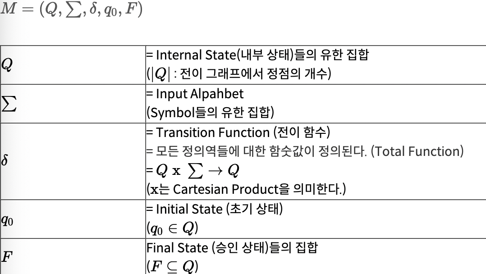
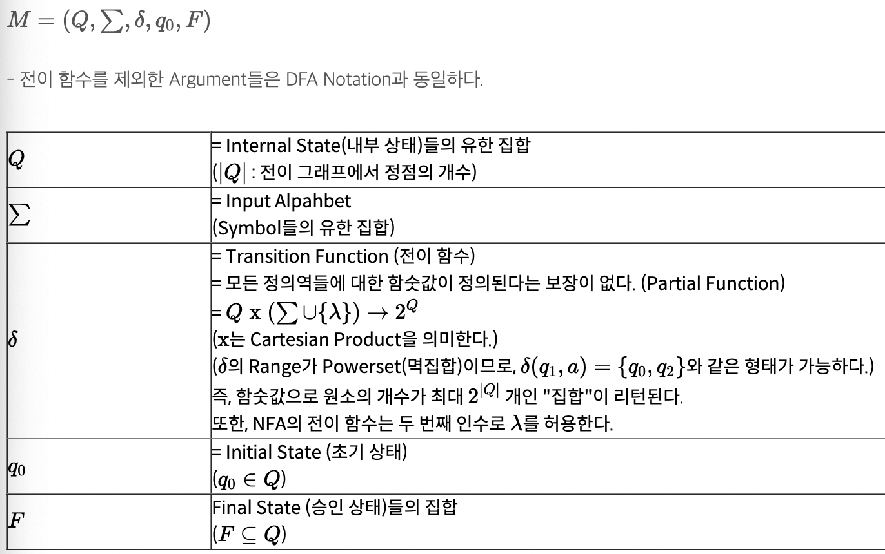
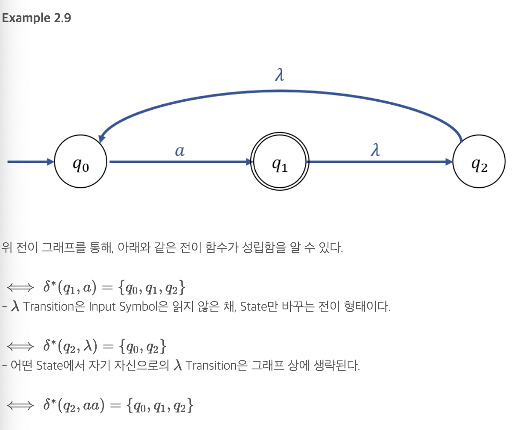
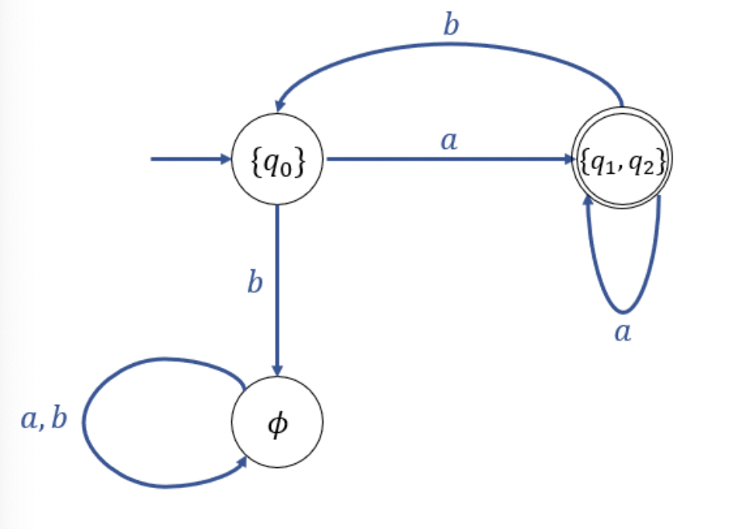
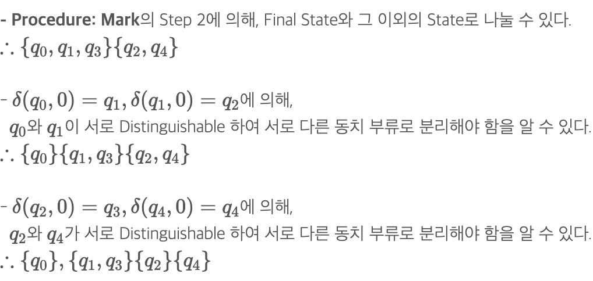
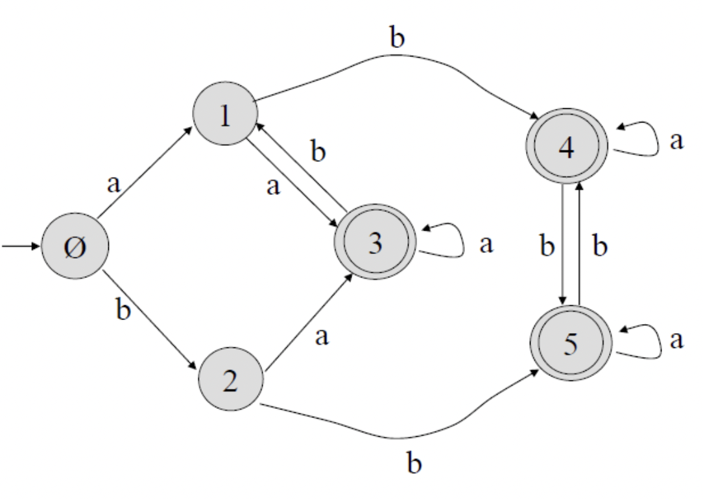
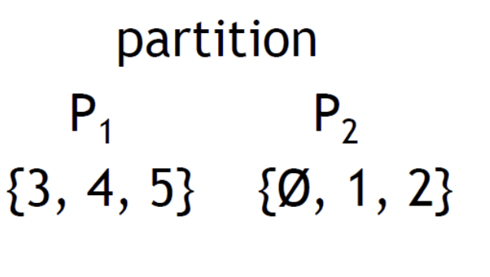
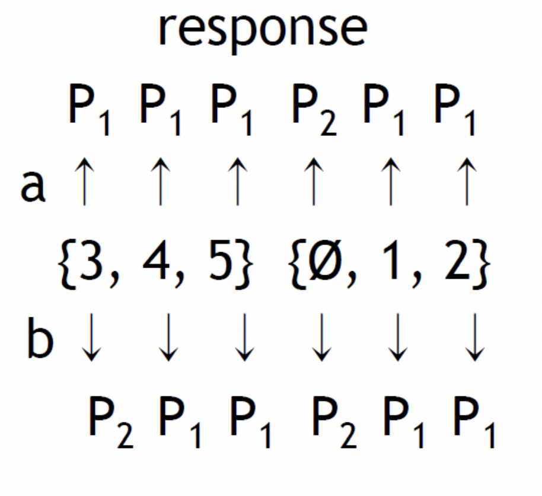

# 유한 오토마타

### DFA (Deterministic Finite Accepter; 결정적 유한 인식기)
    Regular language를 정의하기 위해 사용하는 오토마타.
    Deterministic = 하나만 선택
    MININAL DFA: 동치관계이면서, 가장적은 state갖는
    유한개의 state
    input symbol에 의해 state-> another state

### NFA (Non-Deterministic Finite Automata; 비결정적 유한 인식기)
    백트래킹
    모든가능선 선택 시도

### * Equivalent (동치)
    DFA가 승인하는 Language = NFA가 승하는 Language (동치관계)
    NFA와 동치인 DFA를 구성가능하면 동치

### Transition Graph (G; 전이 그래프)
    "q0"를 가진 정점은 Initial Vertex(시작 정점)이다.
    "qf" (qf∈F)를 가진 정점은 Final Vertex(승인 정점)이다.
    trap state: 다음 상태로 전이될 수 없고 + 입력이 무엇이든 간에 현재 상태만 유지

### 확장전이 함수(Extended Transition Function δ∗ )
    δ(q0,a)=q1  이고, δ(q1,b)=q2 이면, δ∗(q0,ab)=q2이다.

### Def2.2 DFA'M'에 의해 승인되는 L
    DFA M=(Q,∑,δ,q0,F)->L(M)={w∈∑∗:δ∗(q0,w)∈F}
    L(M): DFA M에 의해 Accept되는 언어
    L-(M): DFA에 의해 승안되지 않는 언어

### Def2.3(regular Language)
    L=L(M)을 만족하는 DFA M 이 존재하면 이를 L=Regular Language라고 함 => 언어 L에 대해 DFA를 그릴 수 있으면 Regular Langugae

### Def2.4(NFA Notation)

    λ transition
        NFA에서만 존재
        모든 state에서 자기 자신으로의 λ Transition을 가짐(주로 그래프에서 생략 당연한거기때문)

### NFA 확장 전이 함수 예시 주의

-자기 자신의 λ 생각!

### Def2.6(NFA M에 의해 인식되는 Language)
    L(M) = {w∈∑∗:δ∗(q0,w)∩F=ϕ}
    왜 공집합이지??

### DFA 와 NFA의 동치성
    NFA에 인식되는 모든 언어에 대해 같은 언어를 인식하는 DFA가 존재한다!(항상 존재함)
    state 집합을 이용한다

### Indistinguishable P(구분불가능)
    DFA에서 임의의 두 상태 p,q에 대해
    (δ∗(p,w)∈F)→(δ∗(q,w)∈F)
    (δ∗(p,w)∉F)→(δ∗(q,w)∉F)
    이면 구분 불가능 하다
    즉 p,q가 하는 일이 같다 => 동치 관계에 있다.
    * final state로 가는지에 대한것이 기준

## Produce Mark 알고리즘(이건 치팅시트에 적자)
    Distinguishable한 Pairs들을 마크하는 알고리즘
        1. Inaccessible State 제거
        2. final, not final로 구분
        3. δ(p,a)=pa  와 δ(q,a)=qa를 계산한다. pa와 qa가 Disting하면 따로 구분 (아래의 예시 참고) step 3 반복..
    L(M)=L(ˆM)  인 DFA ˆM을 얻을 수 있다(state가 가장 적인 minimal state인 dfa)

## State Partitioning (minimal DFA를 구하는 다른 방법)- 이게 더 쉬운듯! 이것도 치팅시트 ㄱ

- final state, not-final state로 구분

- 모든 state에 대해 이전에 구했던 집합 P1,P2의 방향성을 정의하고 같은 방향으로 가는거 끼리 다시 묶음
- 4,5는 같은 방향, 3,{4,5}는 다른 방향 1,2는 같은 방향 

