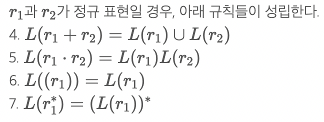
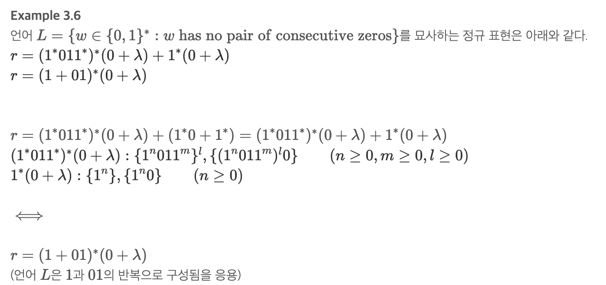
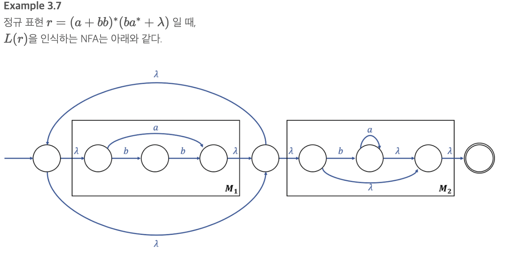
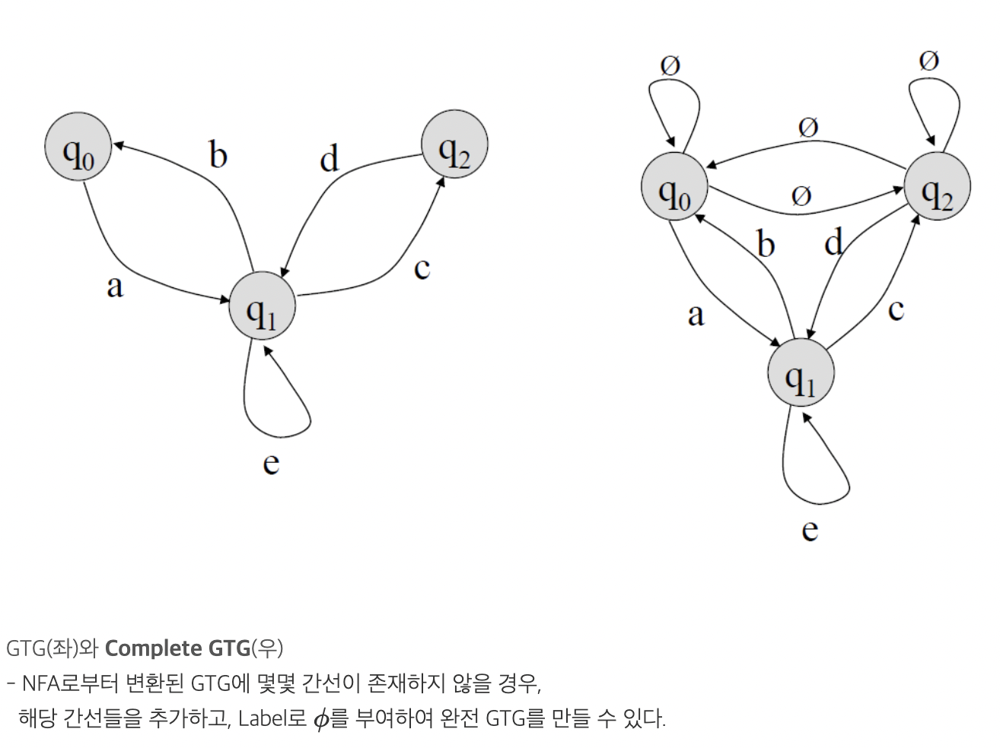
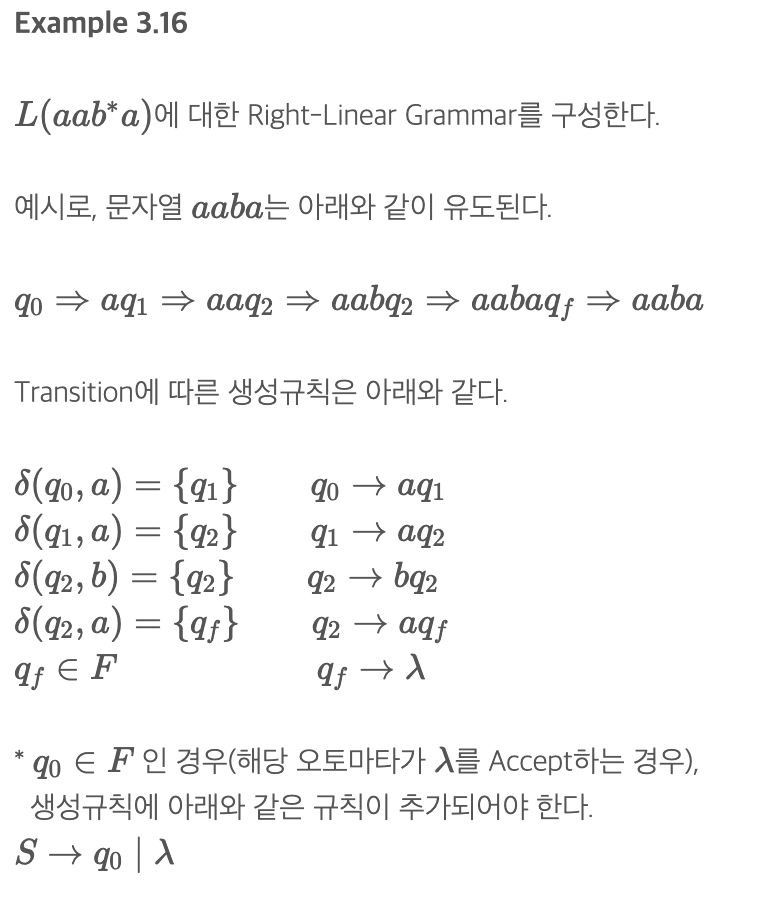
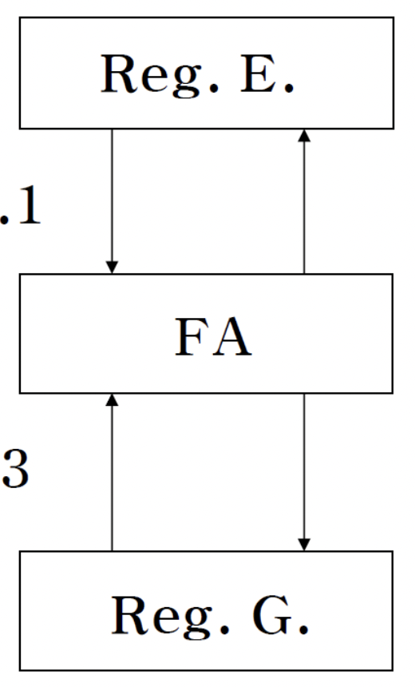

# Regular Languages and Regular Grammar(정규 언어와 정규 문법)

## Regular Expression (정규표현)
    주어진 알파벳 ∑에 대해,ϕ,λ,a∈∑는 모두 정규 표현이다. (이들을 Primitive Regular Expression이라 부른다.)
    r1 과 r2가 정규표현이면,r1+r2,r1⋅r2,r∗1,(r1) 등은 모두 정규 표현이다.
    특정문자열이 정규 표현이 되기 위해서는 해당 정규표현으로 문자열이 유도되어야함

밑의 식의 언어는 1,01의 반복으로 만 구성

## Regular Expression과 정규 언어의 관계(feat M Dfa, Nfa)
    L(r)을 인식하는 NFA가 존재한다.
    λ를 사용해서 연결가능하다

## GTG(Generalized Transition Graph: 일반전이 그래프)
    Edge의 Label로 정규 표현을 부여한 그래프
    GTG에 의해 인식되는 언어는 모두 정규언어(역 성립)

    *Compleete GTG(완전 일반전이 그래프)
        모든 간선 포함하는 GTG
        NFA에서 몇몇간선이 존재하지 않으면 ϕ로 채움
        |V|2  개의 Edge를 가짐

## Regular Grammars(이거 정의 치팅시트!)
    G=(V,T,S,P) 적는거 까먹지 말기!!
    Regular Grammar(정규 문법)은 Right-Linear Grammar이거나, Left-Linear Grammar
    A→xB(right-l)
    A→Bx(left-l)

    변수는 항상 가장 오른쪽에 있거나, 가장 왼쪽에 있어야 함
    우변에 변수가 최대 하나까지만 존재할 수 있다.

## Linear Grammar(치팅시트 적기 Regular랑 차이)
    Regular Grammar에는 속하지 못함
    변수 갯수는 하나이하만 가능(Regular랑 동일)
    but, 변수 위치에는 제한이 없음
    모든 정규 문법은 선형문법이지만 역은 성립 x
    ex)P:S→A A→aB|λ B→Ab (어떤건 left, 어떤건 right이기 때문)

