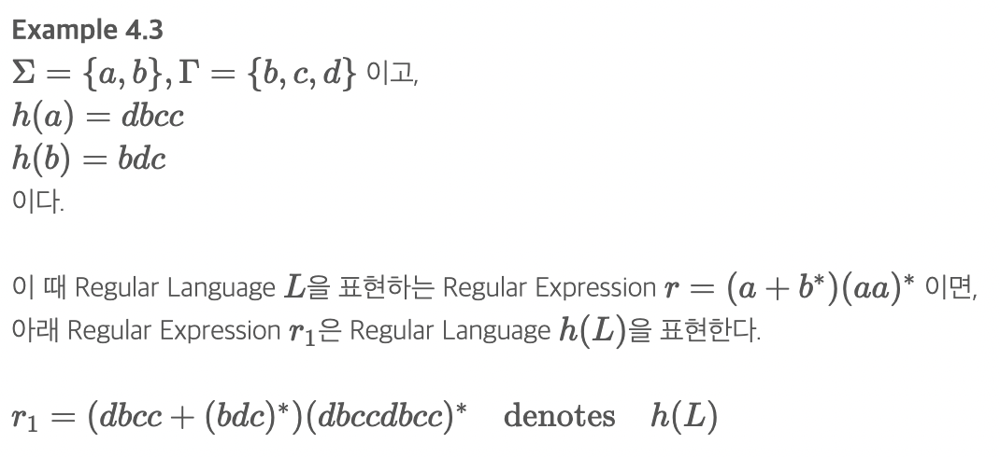

# Properties of Regular Languages(정규 언어의 성질)
#### 어떤 언어가 Regular가 아님을 입증하기 위해서는 Regular Language의 성질을 만족하지 않음을 보여아함

## 간단한 집합 연산에 대한 폐포 성질
    L1,L2가 Regular Language이면,L1=L(r1),L2=L(r2)를 만족하는 Regular Expression r1,r2가 존재한다.
    정의에 의해, r1+r2,r1r2,r∗1는 각각L1∪L2,L1L2,L∗1를 표현하는 Regular Expression들이다.
    L1−L2=L1∩L′2도 가능
    => 모두 Regular Language이다.

## 준동형, 준동형상(Homomorphism)
    준동형은 단일 Symbol을 String으로 대체하는 치환!
    ex w=a1a2⋯an 인 경우, h(w)=h(a1)h(a2)⋯h(an)

## 우측 몫(Right quotient)
 
 - 두번째 예시에서 ba는 불가능 -> L1이 b로 끝나지 않기 때문
 - L1, L2가 Regular L이면 L1/L2도 Regular L이다.

 ## 정규 언어에 대한 기본적 문제(Elementary Questions about Regular Languges)- 치팅시트
    1. MemberShip Problem(소속성 문제): String w가 Language L의 원소가 될 수 있는지 결정하는 문제
    2. MemberShip Algoruthm(소석성 알고리즘):1번 문제를 푸는 알고리즘
    3. Standard Representation for Regular Language(정규언어의 표준 표현)
        - FA(DFA,NFA)
        - Regular Expression
        - Regular Grammar

## L1=L2가 같은지 판단하는 알고리즘
    L3=(L1∩L′2)∪(L′1∩L2)
    L1=L2인경우 L3=ϕ

 
 - 이거 한번 치팅시트에 넣어볼 수 있으면 넣어보기?

 ## Pumping Lemma(펌핑 보조 정리) - 치팅시트
    비둘기집 원리를 응용한 보조정리
    Regular L이 아님을 증명하기 위해 사용
    n개의 정점을 갖는 GTG에서길이가 n을 초과하는 모든 Walk들에는 어떤 정점의 반복이 필히 발생될 수 밖에 없다.
    
    총 4단계
        1) 양의 정숫값 m을 선택한다.
        2) 주어진 m에 대해, L에 속한 길이가 m 이상인 String w를 선택한다. w∈L이고, |w|≥m을 만족하는 어떤 w라도 상관없다.
        3) |xy|≤m,|y|≥1을 만족하도록 w를 xyz로 분할한다.
        4) Pumping된 String wi=xyiz 가 L에 속하지 않도록 i를 선택한다.

두개 치팅 시트 넣을 수 있으면 넣기 이해가 안감

여기 부분은 execise에 있는 문제들에서 최대한 많이 치팅시트에 넣어보기 이해안감 ㅋㅋㅋㅋㅋㅋㅋ

