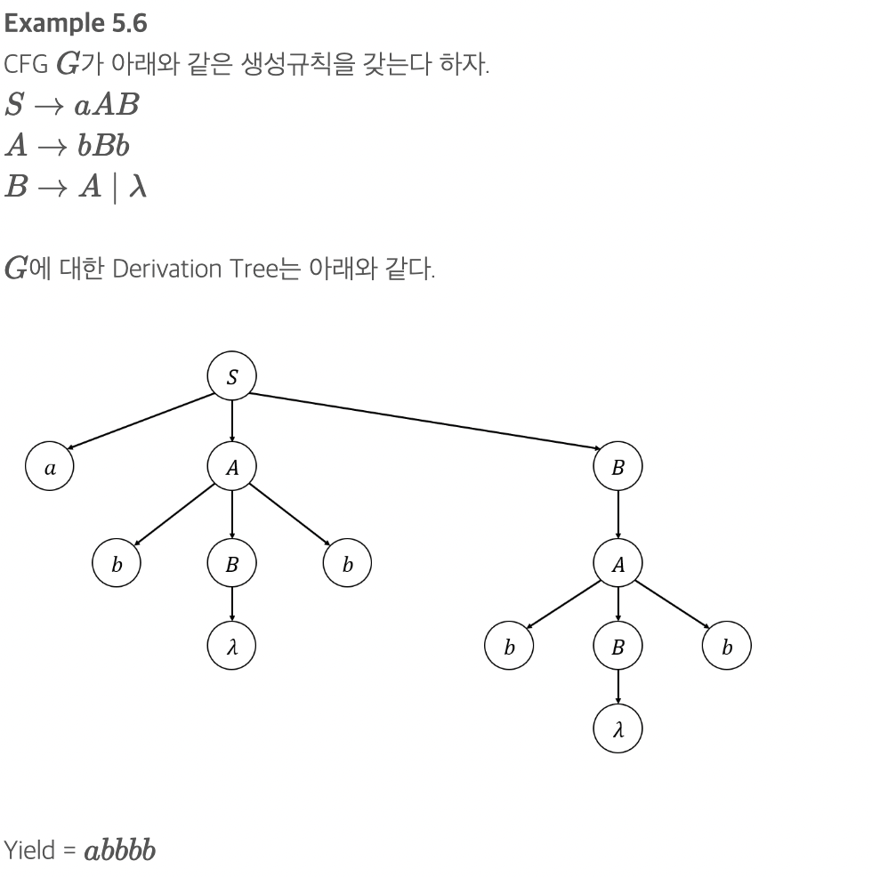

# ConText-Free Languages(문맥자유 언어)

## Context-Free Grammars(문맥-자유 문법)
    CFG의 생성규칙에서 왼쪽항엔 하나의 변수,오른쪽 항에는 Symbol들과 Variable들로 구성된 String이 위치하면, CFG이다.
    G=(V,T,S,P) 에서 모든 생성 규칙이A→x(A∈V,x∈(V∪T)∗)
    Regular G는 항상 CFG이다(역은 성립x)
    Linear G는 항상 CFG이다(역은 성립 x)

## Lestmost and Rightmsot Derivations(좌측 우선 유도와 우측우선 유도)
    Leftmost Derivation(좌측우선 유도)
    - 유도 과정의 각 단계에서 각 Sentential Form의 가장 좌측 변수부터 대체되는 Derivation이다.

    Rightmost Derivation(우측우선 유도)
    - 유도 과정의 각 단계에서 각 Sentential Form의 가장 좌측 변수부터 대체되는 Derivation이다.

## Derivation Tree(유도 트리)
    Derivation과정을 order Tree로 표현
    ParentNode= 좌변 , ChildNode= 우변
    유도트리에서는 생성규칙의 순서를 알 수 없음

## Simple Grammar(S-Grammar)(CFG와 SGrammar 치팅시트 적기)
    CFG G=(V,T,S,P)의 모든 생성규칙들이A→ax
    * Pair(A,a)는 1번 이하로만 나타나야함

## Ambiguous(모호)
