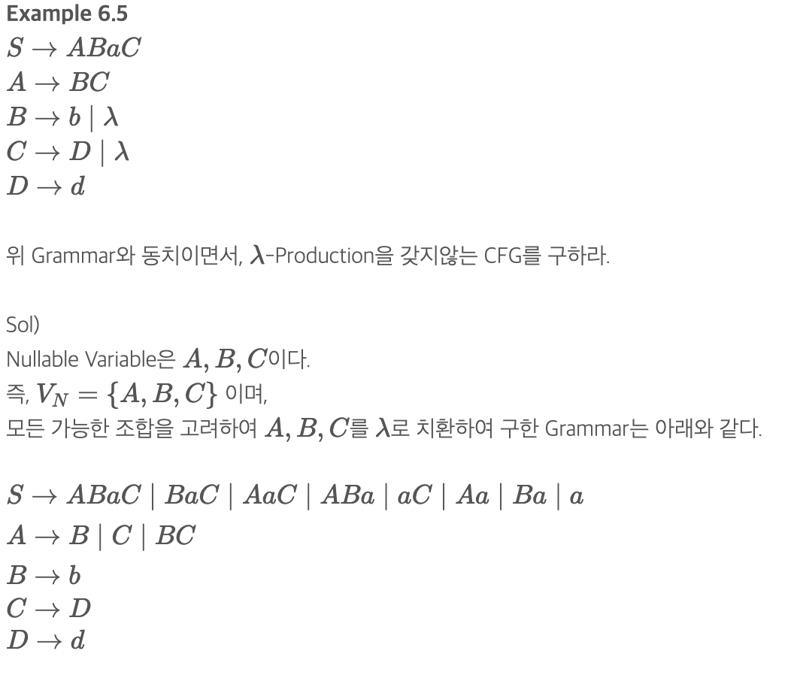
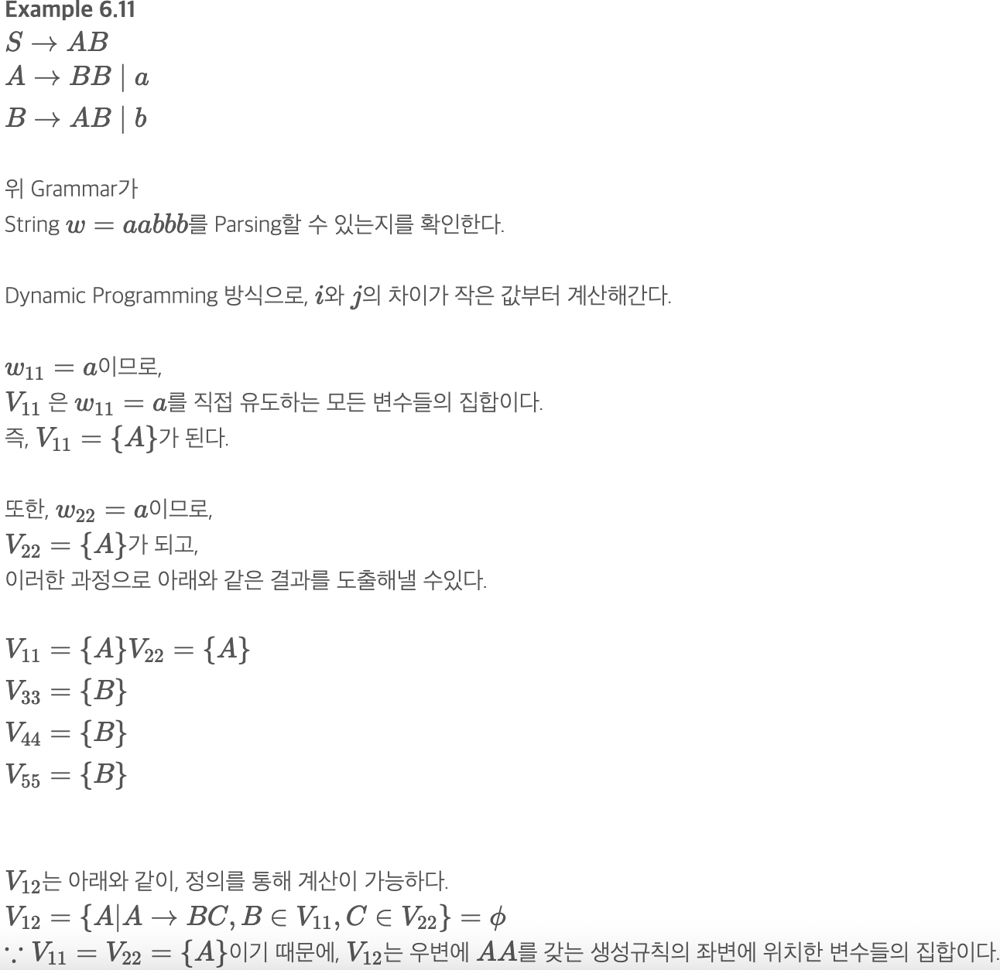
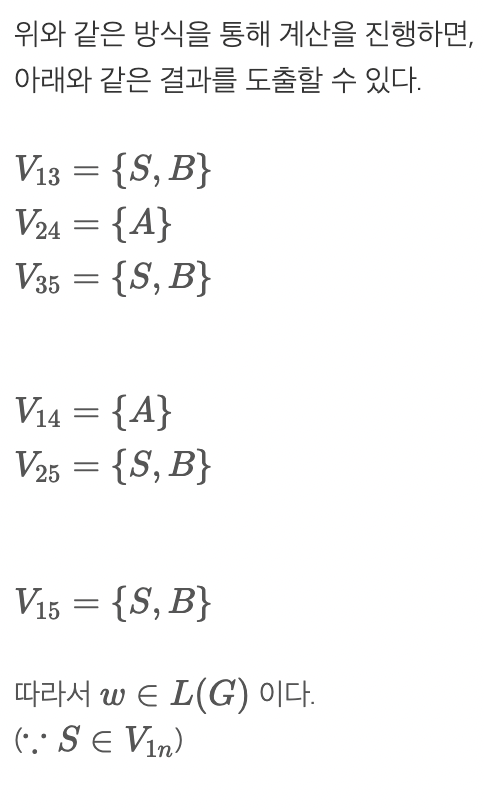

# SIMPLICATION OF CONTEXT-Free Grammars and Normal Forms(문맥-자유 문법의 단순화와 정규형)

## Simplication For Context-Free Grammars(단순화) (치팅시트 순서)
    1. λ-Production제거
    2. Unit_Production제거
    3. Useless Production 제거
    위 3단계 순서 기억!!

## Useful and Useless
    Useless는 Terminal 에 도달하지 못하거나 어떠한 Derivation에 나타날 수 없는경우

## λ-Production, Nullable Variable
    A→λ와 같은 생성규칙을 
    λ-Production이라 한다.
    A⇒∗λ 와 같이,빈 문자열로 유도가 가능한 변수를Nullable Variable이라 한다.

## Unit-Production
    A→B
    Derivation에서 별 다른 의미를 가지지 않기에 쉽게 제거 가능
    1. UnitProduction만 따로 뺌
    2. 최종적으로 1번의 UnitP가 어떻게 Derivation될 수 있는지 적음
    3. 가능한 모든 경우를 P에 추가

# Two Important Normal Forms(정규형)

## Chomsky Normal Form(CNF: Chomsky 정규형)-치팅시트에 적기
    우변에 2가까지의 V 혹은 하나의 Terminal만 가능
    ex A→BC 혹은  A→a
    
    변환 방법
        1. 길이가 2이상인 우변, 새로운 Terminal Symbol로 대체
        2. 우변에 두개의 변수까지만 존재하도록 구성

## Greibach Normal Form (GNF; Greibach 정규형)-치팅시트 적기
    생성규칙의 우변에 있는 String의 길이에는 제한이 없으나,
    Variable과 Terminal Symbol의 위치에 제한을 두는 정규형이다.
    A→ax(a∈T,x∈V∗) 형태를 만족하면 G를 Greibach Normal Form이라 한다.
    S-Grammar의 조건과 비슷하나, Greibach Normal Form에서는 Pair (A,a)가 하나만 존재해야 한다는 제약이 없다.

## CYK Algorithm
    Chomsky Normal Form에 의해 생성된 모든 L의 Membership을 결정지음
    즉 w
    Vij를 계산하는 과정은 아래와 같다.
        1. V11,V22,⋯,Vnn을 계산한다.
        2. V12,V23,⋯,Vn−1,n을 계산한다.
        3. V13,V24,⋯,Vn−2,n을 계산한다.
    이들을 계산하고,
    w∈L(G)⟺S∈V1n 를 이용하여G가 w를 Parsing할 수 있는지를 알아낼 수 있다.(여기서, S는 시작변수이다.)

