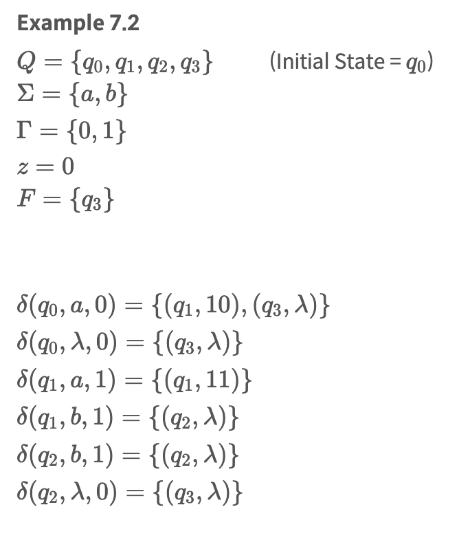
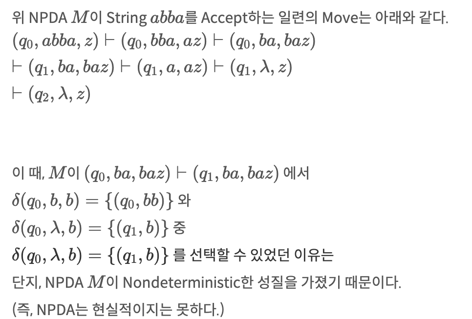

# Push Down Automata

## 푸시다운 오토마타란?
     Stack을 저장장치로 갖는 Finite Automata
     Stack의 크기는 무한 -> 메모리로부터 나오는 한계 극복

## Nondeterministic Pushdown Automata(비결정적 푸시다운 오토마타)

- Control Unit
    - input file로 부터 하나의 Symbol을 읽음 -> Stack연산을 통해 Stack 내용 수정
    - 현재 state는 stack pop에 위치한 Symbol에 의해 결정
- output
    - Control Unit의 State와 stack topd의 원소
- NPDA M=(Q,Σ,Γ,δ,q0,z,F)
    - Q: Control Unit의 Internal state의 유한집합
    - Σ: Input alpabet
    - Γ: Stack Alpabet
    - δ
        - Argument 
            - Control Unit의 현재 State  
            - Input Symbol  
            - Symbol on TOS(Top of Stack)
        - Return : (q,x)  
            - q : Control Unit의 다음 State 
            - x : Stack Top에 놓여질 String
             - δ의 치역은 유한 부분집합이어야 한다.
        - x는 λ가 될 수도 있다. ( 즉, NPDA에서는 λ-Transition이 허용된다.)
        - ### Stack이 비어있으면, 어떠한 Transition도 이루어질 수 없다.
    - q0: Control Unit의 initial state
    - z: stack의 start symbol
    - f: final state들의 집합

### EX)
| 예제              | 설명                                                                                                                                                   |
| ----------------- | ------------------------------------------------------------------------------------------------------------------------------------------------------ |
|  |                                                                                                                                                        |
|  |  L={anbn:n≥0}∪{a}을 Accept, NPDA의 Transition Graph q0→q3 Transition은 {a}를 생성하고,q0→q1→q2→q3 Transition은 {anbn:n≥0}를 생성한다. |

### 순간적 묘사(Instantaneous Description)
    (q1,aw,bx)⊢(q2,w,yx)⟺(q2,y)∈(q1,a,b) 이다.
    - 임의의 여러 단계들을 포함한 이동은 ⊢∗로 표기한다.
    - 특정 Automata M에 의한 이동은 ⊢M 으로 표기한다.

#### EX 7.4
L={w∈{a,b}∗:na(w)=nb(w)}  를 인식하는 NPDA를 구성하자.

- a를 읽을때 마다 Stack에 삽일될 Symbol= 0, b를 읽을땐 삭제
- 만약 stack에 0이 없는 상태에서 b가 입력되면 stack에 1

#### EX 7.5
L={wwR:w∈{a,b}+}를 인식하는 NPDA를 구성하자.
|| |
|----|----|

## Pushdown Automata and Context-free Languages(푸시다운 오토마타와 문맥 자유 언어)
    모든 CFL은 자기자신을 Accept하는 NPDA가 존재
    NPDA에 의해 Accept되는 Language => CFL
    편의를 위해 Greibach Normal Form을 따르거나 변환 필요
    CFL, Grammar를 통해 NPDA를 알아낼 수 있다 <-> 반대도 가능
#### ex 7.6 , 7.7

| ||
|----|---|

## Determinisitc pushdown Automata Deterministic Context-Free Languages(결정적 푸시다운 오토마타와 결정적 문맥 자유 언어)
    조건 1. δ(q,λ,b)는 많아야 한 개의 원소를 포함한다. -> 1개 이하의 이동만 행해질 수 있다.
    조건 2. 만약, δ(q,λ,b)≠ϕ 이면, 모든 c∈Σ에 대해, δ(q,c,b)=ϕ 이어야한다.
        -> 어떤 Configuration에서 λ-Transition을 허용하는 대신, 입력을 사용하는 Transition은 없어야 한다.
        -> λ-Transition과 어떤 입력에 대한 Transition이 공존하면, 경우의 수가 생겨서 Non-Deterministic해지기 때문이다.
    ※ Determinism에 대한 기준은, 모든 경우에서 많아야 하나의 가능한 이동이 존재하느냐는 것이다.
      - 즉, DPDA에서도 정의되지 않은 Transition이 존재할 수도 있다. (Transition이 공집합일 수 있다.)
      - 따라서, DPDA에서도 Dead Configuration(종말 형상)이 존재할 수 있다.
      - 단, 한 경우에 대해 두 가지 이상의 Transition은 존재할 수 없다. (Transition의 원소가 두 개 이상일 수 없다.)

## Grammars for Deterministic Context-Free Languages (결정적 문맥-자유 언어에 대한 문법)

#### LL Grammar (LL 문법)
- 프로그래밍 언어의 모든 면을 아우르기에는 너무 제한적인 S-Grammar에서
  Parsing을 위한 필수적 성질을 잃지 않으면서, 보다 일반화한 문법이다.
- Input의 제한적인 부분을 살펴서, 어떤 생성규칙이 사용되어야 하는지를 예측할 수 있는 성질을 가진 문법이다.
- 모든 S-Grammar는 LL Grammar이다.

#### LL(k) Grammar
- 현재 스캔되는 Symbol과 그 다음의 k−1개의 Symbol을 Look-Ahead(미리보기)하여 일치하는 유일한 생성규칙을 확인할 수 있는 Grammar이다.
- 즉, k개의 Symbol을 읽어 해당되는 생성규칙을 선택할 수 있는 Grammar이다.

#### ex
|| |  
|---|----|